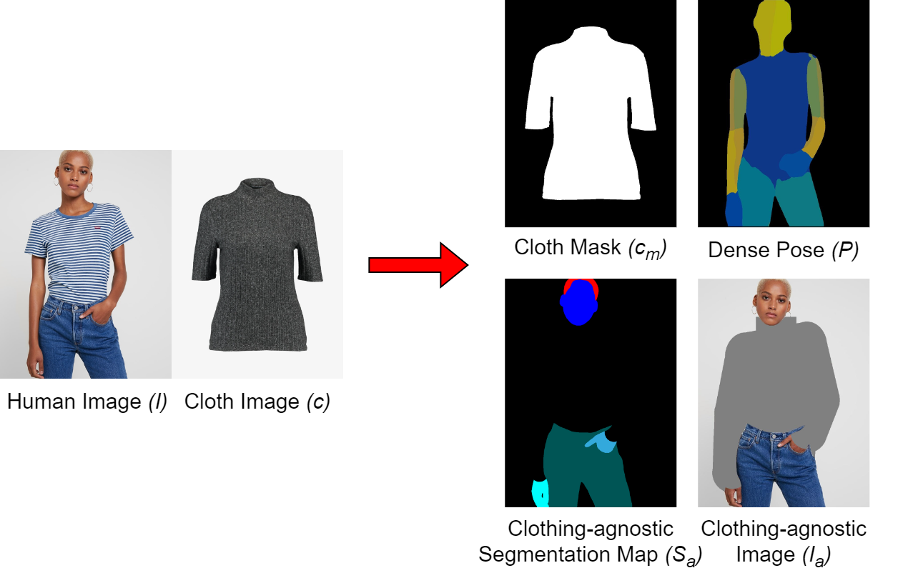
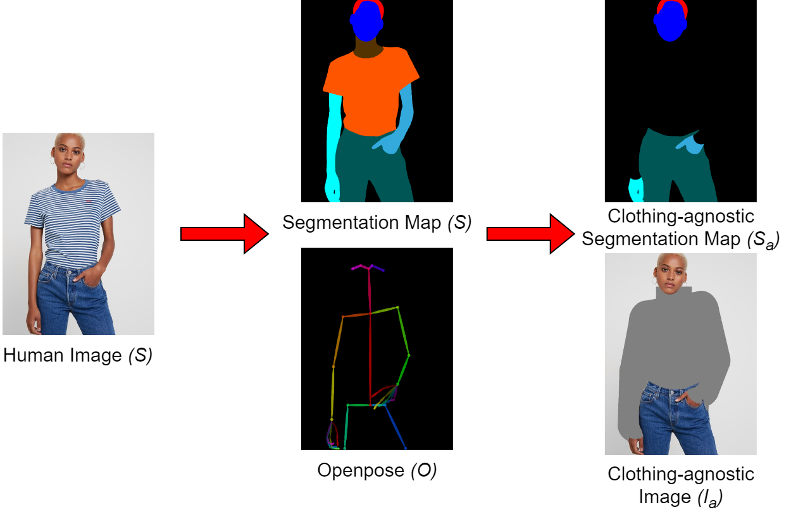

# THESIS

---
# Introduction
---
# Motivation

  
<b>Traditional Shopping</b>

  
<b>Online Shopping</b>

---
# Virtual Try-On
- Digitally trying on garments or accessories in a virtual environment
- Uses images of person and clothing item
- Processes images to create realistic representation

Key challenge: Variability in images (angles, body shapes, resolutions, backgrounds) can lead to inaccurate outputs

---
# Virtual Try-On
- Digitally trying on garments or accessories in a virtual environment
- Uses images of person and clothing item
- Processes images to create realistic representation

Key challenge: Variability in images (angles, body shapes, resolutions, backgrounds) can lead to inaccurate outputs

---

# Our Approach
- Focus on HR-VITON model for image-based virtual try-on
- Conduct experiments exploring impact of loss functions:
- Develop web application for users experience

---
# Outline
- Review related works 
- Provide foundation on GANs 
- Describe implementation and training of 
- Present experiments of different loss functions
- Demonstrate web application with user interface

---
# Related Works
---

# Several approaches to virtual try-on

- Image-based (2D) virtual try-on

- 3D virtual try-on: 

- Multi-pose guided virtual try-on

- Virtual try-on with diffusion models

---
# Image-based Virtual Try-on

- Involves modules for segmentation, warping, and fusion

- Generates map identifying body areas for clothing

- Warps clothing image to match areas 

- Fuses warped clothing with person image

- Notable models: VITON, CP-VTON, VTNFPs

---
# 3D Virtual Try-on 

- Employs 3D models of clothing and humans

- Can simulate cloth behavior and physics

- Allows control over clothing fit and customization

- More complex algorithms and computations

- Notable models:  DeepWrinkles, TailorNet, M3D-VTON

---
# Multi-Pose Guided Virtual Try-on

- Enables clothing transfer in diverse poses

- Overcomes challenges like occlusions and misalignment

**Notable models:**

- MG-VTON [8]: Synthesizes human parsing map, warps clothes, and refines render

- SPG-VTON [9]: Uses semantic prediction to guide multi-pose try-on

---
# Virtual Try-on with Diffusion Models

- Uses diffusion models like DDPM instead of GANs

- Provides more control over quality and diversity

- More stable training process

**Notable models:**

- TryOnDiffusion [10]: Achieves high quality try-on images at 1024 x 1024 resolution

- LaDI-VTON [11]: Combines diffusion models and textual inversion

---
<!-- ---

# Chapter 3: Foundation

---

## Generative Adversarial Networks (GANs)

  <b>Gan architecture</b>

- Generator network (G)
- Discriminator network (D) 

---

# Generator Network

- Creates synthetic samples $x = G(z)$
- Learns to map noise $z \sim p_z$ to real data distribution $p_{data}$
- Output becomes increasingly realistic during training

---

# Discriminator Network

- Classifies real vs. generated samples 
- Identifies features that characterize real data
- Optimized to accurately classify real and fake samples

---
# GAN Formulation

Generator objective:
$$\min_G \mathbb{E}_{z \sim p_z(z)} [ \log(1 - D(G(z)))]$$

Discriminator objective: 
$$\max_D \mathbb{E}_{x \sim p_{data}(x)}[\log D(x)] + \mathbb{E}_{z \sim p_z(z)}[\log(1 - D(G(z)))]$$

Adversarial minimax game between G and D.

---

# Training GANs 

- Generator aims to minimize loss by fooling discriminator
- Discriminator aims to maximize loss by detecting fake samples
- Loss gradients update network parameters

---

# GAN Problems

Common challenges:

- Mode collapse 
- Non-convergence  
- Vanishing gradients

Ongoing research to address these issues.

---

# GAN Loss Variants 

Modified losses can improve training:

- Least squares loss
- Hinge loss 
- Feature matching loss

Help address vanishing gradients, mode collapse, etc.

--- -->

# Implementation

---
## System Overview

  <b>Preprocessing module</b>

---

# Preprocessing Module

- Takes human image $I$ and clothing image $c$
- Generates:
  - Clothing mask $c_m$
  - Densepose $P$
  - Clothing-agnostic segmentation $S_a$
  - Clothing-agnostic image $I_a$

- $P$, $c_m$, $S_a$, $I_a$ are fed to subsequent modules.

---

  <b>Preprocessing module </b>

---

  <b>Clothing-agnostic Processing Flow </b>

---
<!-- 
# Try-On Condition Module -->

Input:

- Clothing image $c$, Cloth mask $c_m$
- Denpose $P$

Output:

- Warped clothing image $\hat{I}_c$ 
- Cloth mask segmentation $\hat{S}_c$
- Segmentation map $\hat{S}$ 
---
# Generator Architecture

- Two encoders  
- Four feature fusion blocks
- Condition Aligning stage

---

<b>Generator Architecture</b>

- Two encoders  
- Four feature fusion blocks
- Condition Aligning stage

---

### Feature Fusion Blocks

- Has two routes: the flow pathway and the seg pathway.

- Takes two inputs, $F_{f_{i-1}}$ and $F_{s_{i-1}}$.

- The two pathways communicate with each other to determine $F_{f_i}$ and $F_{s_i}$ simultaneously.

---
### Feature Fusion Blocks

---

### Condition Aligning

- Aligns segmentation map $\hat{S}$ with clothing item $c$: 

$$\hat{S}_{logit} = \begin{cases} 
\hat{S}_{raw}^{k,i,j} & \text{if } k \neq C \\
\hat{S}_{raw}^{k,i,j} \cdot W(c_m,F_f) & \text{if } k = C  
\end{cases}$$

$$\hat{S}= \sigma (\hat{S}_{logit})$$ 

- Remove occlusion and get final $\hat{S}_c$ and $\hat{I}_c$.
---
# Multi-Scale Discriminator

- Each $D_i$ operates on downsampled $S_i$
- Concatenates $\hat{Y}_i$ outputs into final $Y$
- Captures multi-scale information
- $k$ of $N$-layer sub-discriminators $D_i$
---

  <b>Multi-Scale Discriminator</b>

- Each $D_i$ operates on downsampled $S_i$
- Concatenates $\hat{Y}_i$ outputs into final $Y$
- Captures multi-scale information
- $k$ of $N$-layer sub-discriminators $D_i$

---
# Sub-discriminator </b>

- Input: Downsampled segmentation map $S_i$  
- Output: Prediction map $\hat{Y}_i$
- Consits of $N$ convolutional layers
---

  <b>Sub-discriminator </b>

- Input: Downsampled segmentation map $S_i$  
- Output: Prediction map $\hat{Y}_i$
- Consits of $N$ convolutional layers

---
# Training Try-On Condition modules
Cross-entropy loss

$\mathcal{L}_{CE} = L(S, \hat{S}) = - [S \log p(S|\hat{S})+(1-S)\log(1-p(S|\hat{S}))] \tag{4.4}$

L1 loss

$\mathcal{L}_{L1} =  \sum_{i=0}^3 w_i  .\left| \left|W(c_m,F_{f_i})-S_c \right| \right|_1 +||\hat{S_c}- S_c||_1 \tag{4.5}$

VGG loss

$\mathcal{L}_{VGG} = \sum_{i=0}^3 w_i  . \phi(W(c,F_{f_i}),I_c) + \phi(\hat{I_c},I_c) \tag{4.6}$

---

# Training Try-On Condition modules
Loss TV

$\mathcal{L}_{TV}= ||\nabla F_{f4}|| \tag{4.7}$

Least square GAN loss

$\mathcal{L}_{cGAN}=\underset{G}{min}V_{LS}(G)= \frac{1}{2}E_{z\sim p_{z}(z)} \left[\left(D\left(G(z)\right)-1\right)^2\right] \tag{4.9}$

---

# Training Try-On Condition module

Generator loss:

$$\mathcal{L}_{TOCG} = \lambda_{CE} \mathcal{L}_{CE} + \mathcal{L}_{cGAN} + \lambda_{L1}\mathcal{L}_{L1} + \mathcal{L}_{VGG} + \lambda_{TV}\mathcal{L}_{TV}$$

Discriminator loss:

$$\mathcal{L}_{D}^{LS} = \frac{1}{2}\mathbb{E}_{S\sim p_{data}(S)}[(D(S)-1)^2] + \frac{1}{2}\mathbb{E}_{z\sim p_z(z)}[D(G(z))^2]$$

---

<!-- # Try-On Image Module 
Input:
- Clothing-agnostic image $I_a$, 
- Warped clothing image $\hat{I}_c$, 
- Denpose $P$, Segmentation map $\hat{S}$ 

Output

- Final try-on image $\hat{I}$ -->
# Generator architecture</b>

  - 2 $3\times3$ convolutions 
  - SPADE residual blocks
    - Leverage $\hat{S}$ to guide image generation
    - Using SPADE normalization

---

  <b>Generator architecture</b>

  - 2 $3\times3$ convolutions 
  - SPADE residual blocks
    - Leverage $\hat{S}$ to guide image generation
    - Using SPADE normalization

---
## SPADE Residual Block

<!-- 

  <b>Spade Residual Block</b>

 -->
---
# Training Try-On Image
L1 loss

$\mathcal{L}_{L1} =  ||\hat{I}- I||_1 \tag{4.12}$

Feature Matching loss

$\mathcal{L}_{FM}=\frac{1}{k}\sum_{i=0}^{k-1}||Di(G(z)) - Di(I_i)||_1 \tag{4.13} \label{eq:FM}$

---
# Training Try-On Image
Apply different loss to $\mathcal{L}_{TOIG}^{cGAN}$ in each experiment
- Hinge Loss
- Least square loss
- Cross Entropy

---

# Training Try-On Image

Generator loss: 

$$\mathcal{L}_{TOIG} = \mathcal{L}_{TOIG}^{cGAN} + \lambda_{TOIG}^{VGG}\mathcal{L}_{TOIG}^{VGG} + \lambda_{TOIG}^{FM}\mathcal{L}_{TOIG}^{FM} + \lambda_{TOIG}^{L1}\mathcal{L}_{TOIG}^{L1}$$

Discriminator loss:

$$\mathcal{L}_{D} = -\mathbb{E}_{I\sim p_{data}}[\text{max}(0, -1 + D(I))] - \mathbb{E}_{z\sim p_z}[\text{max}(0, -1 - D(\hat{I}))]$$

---

# Chapter 5: Experiments

---

# Dataset

- High-resolution virtual try-on dataset from VITON-HD [1] 
- 13,679 frontal-view woman and top clothing image pairs
- 1024 x 768 resolution
- 11,647 pairs for training, 2,032 for testing

---
 # Evaluation Metrics

# Experiments

- Goal: investigate and improve generator model performance by exploring different loss functions
- Focus: Loss function of Try-On Image module includes GAN loss, L1 loss, and Feature Matching (FM) loss, each associated with a lambda parameter
- GAN loss function can be selected between Cross-Entropy (CE) GAN loss, Least Square (LS) GAN loss, and Hinge GAN loss

---

# Experiments
Two experiments conducted:
- Experiment 1:
Investigate impact of L1 and FM losses on generator performance and find optimal set of lambda values for generator loss function

- Experiment 2:
Analyze specific impact of each GAN loss function in combination with L1 and FM on performance of generator model

---

# Experiments
Training parameters: resolution of 512x384, batch size of 8, total of 30,000 training steps

Evaluation metrics:
- SSIM: Structural Similarity Index
- MSE: Mean Squared Error
- LPIPS: Learned Perceptual Image Patch Similarity

---

# Experiment 1: L1 vs. FM Loss

**No L1 and FM losses**
| L1 Lambda | FM Lambda | SSIM ↑ | MSE ↓ | LPIPS ↓ |
|---|---|---|---|---|
| 0 | 0 | 0.89926 | 0.00504 | 0.03876 |

---

# Experiment 1: L1 vs. FM Loss

**Fix FM and Change L1 Lambda**
| L1 Lambda | FM Lambda | SSIM ↑ | MSE ↓ | LPIPS ↓ |
|---|---|---|---|---|
 0 | 10 | 0.91743 | 0.00294 | 0.02229 |
| 10 |  | 0.91493 | 0.00282 | 0.02430 |
| 20 |  | 0.91391 | 0.00281 | 0.02498 |
| 30 | | 0.91579 | 0.00262 | 0.02398 |

---
# Experiment 1: L1 vs. FM Loss
**Fix L1 and Change FM Lambda**
| L1 Lambda | FM Lambda | SSIM ↑ | MSE ↓ | LPIPS ↓ |
|---|---|---|---|---|
| 10 | 0 | 0.90886| 0.00329 |0.02884 | 
|  | 10 | 0.91493| 0.00282| 0.02430 |
|  | 20 | 0.91985 |0.00257| 0.02488 |
|  | 30| 0.92091 |0.00257 |0.02335 |

---

# Experiment 1: L1 vs. FM Loss
## Keys finding
- L1 and FM losses improve generator performance 
- FM more impactful than L1
---

# Experiment 2: GAN Losses

**Hinge GAN**

| Losses | SSIM ↑ | MSE ↓ | LPIPS ↓ |  
|-|-|-|-|
| No L1, No FM | 0.89926 | 0.00504 | 0.03876 |
| L1 Only | 0.90886 | 0.00329 | 0.02884 |
| FM Only | 0.91949 | 0.00266 | 0.02264 | 
| L1 + FM | 0.91932 | 0.00254 | 0.02341 |

---
# Experiment 2: GAN Losses
**LS GAN**

| Losses | SSIM ↑ | MSE ↓ | LPIPS ↓ |
|-|-|-|-|  
| No L1, No FM | 0.89823 | 0.00522 | 0.04360 |
| L1 Only | 0.91185 | 0.00295 | 0.03442 |
| FM Only | 0.92377 | 0.00239 | 0.02430 |
| L1 + FM | 0.92363 | 0.00229 | 0.02560 |

--- 
# Experiment 2: GAN Losses
**CE GAN**

| Losses | SSIM ↑ | MSE ↓ | LPIPS ↓ |
|-|-|-|-|
| No L1, No FM | 0.89868 | 0.00512 | 0.04064 |  
| L1 Only | 0.91070 | 0.00312 | 0.03512 |
| FM Only | 0.92250 | 0.00263 | 0.02403 |
| L1 + FM | 0.92567 | 0.00225 | 0.02258 |

---

# Experiment 2: GAN Losses
## Keys finding
- GAN loss combined with L1 and FM acan significantly impact the performance of a generator
- Cross-Entropy (CE) GAN loss function is the most effective for this particular task

---
## Application Overview

- Allow users to upload human and clothing images
- Generate output images showing human wearing clothing
- Implemented using microservice architecture

---   

# Application Pipeline

  <b>Spade Residual Block</b>

---
## Implementation Challenges

- Lack of GPU compute power
- Complex pre-processing for HR-VITON
- Mismatch between pre-processing and dataset
- 4-5 minutes end-to-end runtime 

---

## Key Takeaways

- Application works but slow runtime
- Sufficient compute resources needed
- Pre-processing must match dataset
- Model complexity challenges deployment
  
---

# Chapter 6: Conclusion

<!-- ---

# Summary

- Aimed to develop virtual try-on application using HR-VITON model
- Explored impact of different loss functions through experiments:
  - Perceptual loss
  - Adversarial loss
  - Feature matching loss
- Developed web application for virtual try-on experience

---

# Key Findings

- Incorporating L1 and FM losses improves generator performance
- FM loss has more impact than L1 loss 
- CE GAN + L1 + FM achieves best performance

---
# Conclusion
## Limitations

- HR-VITON model is complex and resource intensive
- Extensive preprocessing is required
- More experiments needed for comprehensive analysis -->

---

# Conclusion

- Achieved promising results for virtual try-on application
- Provided insights into effectiveness of loss functions
- Web application makes research accessible
- Future research: optimizing the pre-processing steps and exploring alternative models