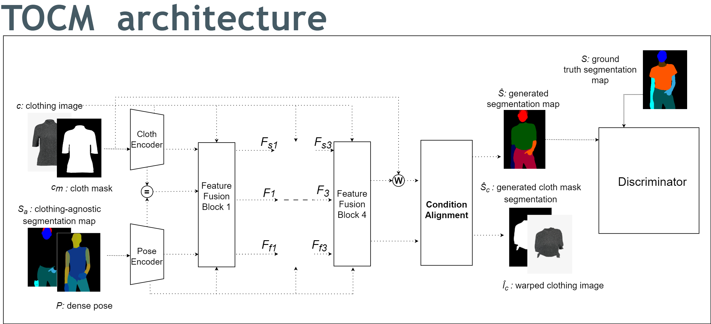
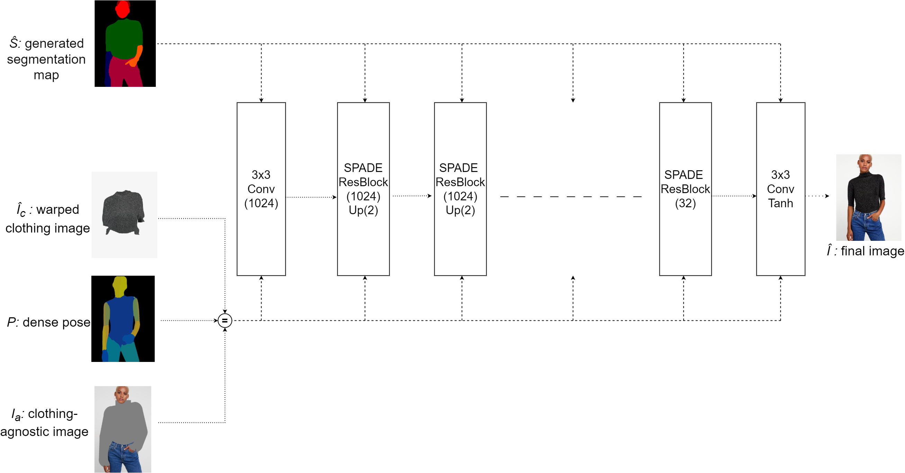

# THESIS

### DEVELOPING A VIRTUAL TRY-ON CLOTHES APPLICATION

NGUYỄN HOÀNG LINH 19125103 - NGUYỄN PHẠM TÙNG LÂM 19125056

#### THESIS ADVISORS

Mr. PHẠM MINH HOÀNG - Dr. VÕ HOÀI VIỆT

---
# Outline
- Introduction
- Related works 
- Implementation 
- Experiments
- Conclusion
- Demo: Web application

---

  
### Introduction

---
# Motivation

|                 |                     |
|-----------------|---------------------|
| **Traditional Shopping** | **Online Shopping**     |
| Require visit stores physically | Convenience         |
| Limited inventory | Wider range of products
| Able to try-on clothes | Unable to try on clothes |
| 
 | 
 |

---
# Virtual Try-On Application
- Digitally trying on garments or accessories in a virtual environment
- Approach: Image-based virtual try-on
- Scope:
  - Input: A human image and a cloth image 
  - Output: Image of the human wearing the target cloth
  - Human Image captured from a front view, with a clear background and minimal noise

---

# Our Approach
- Focus on HR-VITON model, a promising image-based virtual try-on approach
- Goal: 
  - Investigate and improve the performance of the model by exploring different loss functions
  - Develop a web application system

---

  
### Related Works

---

# Several approaches to Virtual Try-on

- Image-based (2D) virtual try-on

- 3D virtual try-on

- Multi-pose guided virtual try-on

- Virtual try-on with diffusion models

---
# Image-based Virtual Try-on

- Involves modules for segmentation, warping, and fusion

- Generates map identifying body areas for clothing

- Warps clothing image to match areas 

- Fuses warped clothing with person image

- Notable works: VITON, CP-VTON, VTNFPs

---
# 3D Virtual Try-on 

- Employs 3D models of clothing and humans

- Can simulate cloth behavior and physics

- Allows control over clothing fit and customization

- More complex algorithms and computations

- Notable works:  DeepWrinkles, TailorNet, M3D-VTON

---
# Multi-Pose Guided Virtual Try-on

- Enables clothing transfer in diverse poses

- Overcomes challenges like occlusions and misalignment

- Notable works: MG-VTON, SPG-VTON

---
# Virtual Try-on with Diffusion Models

- Uses diffusion models like DDPM instead of GANs

- Provides more control over quality and diversity

- More stable training process

- Notable works: TryOnDiffusion, LaDI-VTON

---
<!-- ---

# Chapter 3: Foundation

---

## Generative Adversarial Networks (GANs)

  <b>Gan architecture</b>

- Generator network (G)
- Discriminator network (D) 

---

# Generator Network

- Creates synthetic samples $x = G(z)$
- Learns to map noise $z \sim p_z$ to real data distribution $p_{data}$
- Output becomes increasingly realistic during training

---

# Discriminator Network

- Classifies real vs. generated samples 
- Identifies features that characterize real data
- Optimized to accurately classify real and fake samples

---
# GAN Formulation

Generator objective:
$$\min_G \mathbb{E}_{z \sim p_z(z)} [ \log(1 - D(G(z)))]$$

Discriminator objective: 
$$\max_D \mathbb{E}_{x \sim p_{data}(x)}[\log D(x)] + \mathbb{E}_{z \sim p_z(z)}[\log(1 - D(G(z)))]$$

Adversarial minimax game between G and D.

---

# Training GANs 

- Generator aims to minimize loss by fooling discriminator
- Discriminator aims to maximize loss by detecting fake samples
- Loss gradients update network parameters

---

# GAN Problems

Common challenges:

- Mode collapse 
- Non-convergence  
- Vanishing gradients

Ongoing research to address these issues.

---

# GAN Loss Variants 

Modified losses can improve training:

- Least squares loss
- Hinge loss 
- Feature matching loss

Help address vanishing gradients, mode collapse, etc.

--- -->

  
### Implementation

---
## System Overview

  <b>Preprocessing module</b>

---

# Preprocessing Module

---

  <b>Clothing-agnostic Processing Flow </b>

---

### Try-On Condition Module

<!-- Input:

- Clothing image $c$, Cloth mask $c_m$
- Denpose $P$

Output:

- Warped clothing image $\hat{I}_c$ 
- Cloth mask segmentation $\hat{S}_c$
- Segmentation map $\hat{S}$

--- -->
<!-- # Generator Architecture -->

<!-- - Two encoders  
- Four feature fusion blocks
- Condition Aligning stage -->

<!-- 

<b>Generator Architecture</b>

- Two encoders  
- Four feature fusion blocks
- Condition Aligning stage -->

<!-- 
 -->

---

### Feature Fusion Blocks

<!-- - Has two routes: the flow pathway and the seg pathway.
- Takes two inputs, $F_{f_{i-1}}$ and $F_{s_{i-1}}$.
- The two pathways communicate with each other to determine $F_{f_i}$ and $F_{s_i}$ simultaneously. -->

---

### Condition Aligning

- Aligns segmentation map $\hat{S}$ with clothing item $c$: 

$$\hat{S}_{logit} = \begin{cases} 
\hat{S}_{raw}^{k,i,j} & \text{if } k \neq C \\
\hat{S}_{raw}^{k,i,j} \cdot W(c_m,F_f) & \text{if } k = C  
\end{cases}$$

$$\hat{S}= \sigma (\hat{S}_{logit})$$ 

- Remove occlusion and get final $\hat{S}_c$ and $\hat{I}_c$.
---
##### Multi-Scale Discriminator

<!-- - Each $D_i$ operates on downsampled $S_i$
- Concatenates $\hat{Y}_i$ outputs into final $Y$
- Captures multi-scale information
- $k$ of $N$-layer sub-discriminators $D_i$
--- -->

<!-- 

  <b>Multi-Scale Discriminator</b>

- Each $D_i$ operates on downsampled $S_i$
- Concatenates $\hat{Y}_i$ outputs into final $Y$
- Captures multi-scale information
- $k$ of $N$-layer sub-discriminators $D_i$

 -->

---
##### Sub-discriminator

<!-- - Input: Downsampled segmentation map $S_i$  
- Output: Prediction map $\hat{Y}_i$
- Consits of $N$ convolutional layers
--- -->

<!-- 

  <b>Sub-discriminator </b>

- Input: Downsampled segmentation map $S_i$  
- Output: Prediction map $\hat{Y}_i$
- Consits of $N$ convolutional layers

 -->

---
# Training Try-On Condition module
- Cross-entropy loss

$\mathcal{L}_{CE} = L(S, \hat{S}) = - [S \log p(S|\hat{S})+(1-S)\log(1-p(S|\hat{S}))] \tag{4.4}$

- L1 loss

$\mathcal{L}_{L1} =  \sum_{i=0}^3 w_i  .\left| \left|W(c_m,F_{f_i})-S_c \right| \right|_1 +||\hat{S_c}- S_c||_1 \tag{4.5}$

- VGG loss

$\mathcal{L}_{VGG} = \sum_{i=0}^3 w_i  . \phi(W(c,F_{f_i}),I_c) + \phi(\hat{I_c},I_c) \tag{4.6}$

---

# Training Try-On Condition module
- Loss TV

$\mathcal{L}_{TV}= ||\nabla F_{f4}|| \tag{4.7}$

- Least square GAN loss

$\mathcal{L}_{cGAN}=\underset{G}{min}V_{LS}(G)= \frac{1}{2}E_{z\sim p_{z}(z)} \left[\left(D\left(G(z)\right)-1\right)^2\right] \tag{4.9}$

---

# Training Try-On Condition module

Generator loss:

$$\mathcal{L}_{TOCG} = \lambda_{CE} \mathcal{L}_{CE} + \mathcal{L}_{cGAN} + \lambda_{L1}\mathcal{L}_{L1} + \mathcal{L}_{VGG} + \lambda_{TV}\mathcal{L}_{TV}$$

Discriminator loss:

$$\mathcal{L}_{D}^{LS} = \frac{1}{2}\mathbb{E}_{S\sim p_{data}(S)}[(D(S)-1)^2] + \frac{1}{2}\mathbb{E}_{z\sim p_z(z)}[D(G(z))^2]$$

---

<!-- # Try-On Image Module 
Input:
- Clothing-agnostic image $I_a$, 
- Warped clothing image $\hat{I}_c$, 
- Denpose $P$, Segmentation map $\hat{S}$ 

Output

- Final try-on image $\hat{I}$ -->
### Try-On Image Module
<!-- Generator architecture -->

  <!-- - 2 $3\times3$ convolutions 
  - SPADE residual blocks
    - Leverage $\hat{S}$ to guide image generation
    - Using SPADE normalization

--- -->

  <b>Generator architecture</b>

  - 2 $3\times3$ convolutions 
  - SPADE residual blocks
    - Leverage $\hat{S}$ to guide image generation
    - Using SPADE normalization

---
## SPADE Residual Block

<!-- 

  <b>Spade Residual Block</b>

 -->
---
# Training Try-On Image
L1 loss

$\mathcal{L}_{L1} =  ||\hat{I}- I||_1 \tag{4.12}$

Feature Matching loss

$\mathcal{L}_{FM}=\frac{1}{k}\sum_{i=0}^{k-1}||Di(G(z)) - Di(I_i)||_1 \tag{4.13} \label{eq:FM}$

---
# Training Try-On Image
Apply different loss to $\mathcal{L}_{TOIG}^{cGAN}$ in each experiment
- Hinge Loss
- Least square loss
- Cross Entropy

---

# Training Try-On Image

Generator loss: 

$$\mathcal{L}_{TOIG} = \mathcal{L}_{TOIG}^{cGAN} + \lambda_{TOIG}^{VGG}\mathcal{L}_{TOIG}^{VGG} + \lambda_{TOIG}^{FM}\mathcal{L}_{TOIG}^{FM} + \lambda_{TOIG}^{L1}\mathcal{L}_{TOIG}^{L1}$$

Discriminator loss:

$$\mathcal{L}_{D} = -\mathbb{E}_{I\sim p_{data}}[\text{max}(0, -1 + D(I))] - \mathbb{E}_{z\sim p_z}[\text{max}(0, -1 - D(\hat{I}))]$$

---

  
### Experiments

---

# Dataset

- High-resolution virtual try-on dataset from VITON-HD
- 13,679 frontal-view woman and top clothing image pairs
- 1024 x 768 resolution
- 11,647 pairs for training, 2,032 for testing

---
 # Evaluation Metrics
 - SSIM
 $SSIM(x, y) = \frac{(2\mu_x\mu_y + C_1)(2\sigma_{xy} + C_2)}{(\mu_x^2 + \mu_y^2 + C_1)(\sigma_x^2 + \sigma_y^2 + C_2)}$

 - MSE
 $MSE(x, y) = \frac{1}{n}\sum_{i=1}^{n}(x_i - y_i)^2$

 - LPIPS
 $LPIPS(x, y) = \frac{1}{N}\sum_{i=1}^{N}|f_i(x) - f_i(y)|_2$

---
# Experiments

- Goal: Investigate and improve generator model performance by exploring different loss functions
- Focus: Loss function of Try-On Image module includes GAN loss, L1 loss, and Feature Matching (FM) loss.
- GAN loss function:
  - Cross-Entropy (CE) GAN loss
  - Least Square (LS) GAN loss
  - Hinge GAN loss

---

# Experiments
Two experiments conducted:
- Experiment 1:
Investigate impact of L1 and FM losses on generator performance and find optimal set of lambda values for generator loss function

- Experiment 2:
Analyze specific impact of each GAN loss function in combination with L1 and FM on performance of generator model

---

## Experiment 1: L1 vs. FM Loss

---
## Experiment 1: L1 vs. FM Loss

---

## Experiment 1: L1 vs. FM Loss
### Keys finding
- L1 and FM losses improve generator performance 
- FM more impactful than L1
---

## Experiment 2: GAN Losses

---

## Experiment 2: GAN Losses

---

## Experiment 2: GAN Losses
### Keys finding
- GAN loss combined with L1 and FM acan significantly impact the performance of a generator
- Cross-Entropy (CE) GAN loss function is the most effective for this particular task

---
## Application Overview

- Input: A human image and a cloth image
- Output: Generated image of the human wearing the cloth
- Architecture: Microservice 
- Programming language: Python
- Communication between services: gRPC
- User Interface: Streamlit
- Deploy: Docker

--- 

## Application

---

## Application Pipeline

---
<!-- ## Discussion

--- -->

## Limitations

- HR-VITON model requires resource intensive for training.
- Complex pre-processing.
- Application works but slow runtime, particularly segmentation map of the human.
- Pre-processing must match dataset
  
---

  
### Conclusion

---

# Conclusion

- Achieved promising results for virtual try-on application
- Provided insights into effectiveness of loss functions when training HR-VITON model
- Web application makes research accessible
- Future research: Optimizing the pre-processing steps and exploring alternative models