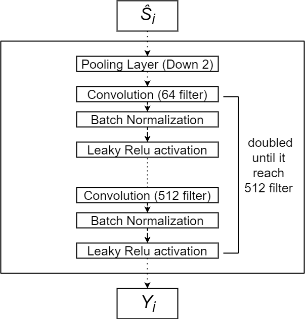
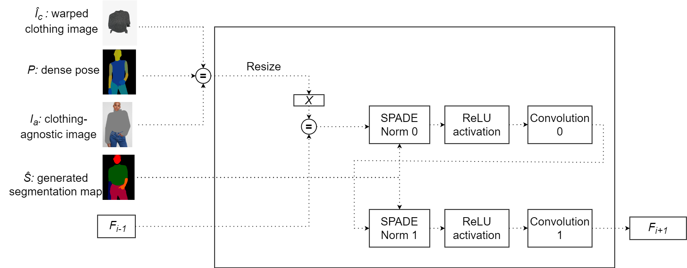

# THESIS

---
# Introduction
---
# Motivation

  
<b>Traditional Shopping</b>

  
<b>Online Shopping</b>

---
# Virtual Try-On
- Digitally trying on garments or accessories in a virtual environment
- Uses images of person and clothing item
- Processes images to create realistic representation

Key challenge: Variability in images (angles, body shapes, resolutions, backgrounds) can lead to inaccurate outputs

---

# Our Approach
- Focus on HR-VITON model [1] for image-based virtual try-on
- Conduct experiments exploring impact of loss functions:
- Develop web application for users to experience virtual try-on process

---
# Outline
- Review related works 
- Provide foundation 
- Describe implementation and training 
- Present experiments of different loss functions
- Demonstrate web application with user interface

---
# Chapter 2: Related Works
---

# Several approaches to virtual try-on

- Image-based (2D) virtual try-on

- 3D virtual try-on: 

- Multi-pose guided virtual try-on

- Virtual try-on with diffusion models

---
# Image-based Virtual Try-on

- Involves modules for segmentation, warping, and fusion

- Generates map identifying body areas for clothing

- Warps clothing image to match areas 

- Fuses warped clothing with person image

---
# Image-based Virtual Try-on

**Notable models:**

- VITON [2]: Pioneering virtual try-on method using coarse-to-fine strategy 

- CP-VTON [3]: Focuses on preserving clothing characteristics during try-on

- VTNFP [4]: Aims to preserve body and clothing features throughout process

---
# 3D Virtual Try-on 

- Employs 3D models of clothing and humans

- Can simulate cloth behavior and physics

- Allows control over clothing fit and customization

- More complex algorithms and computations

---
# 3D Virtual Try-on

**Notable models:** 

- DeepWrinkles [5]: Simulates clothing wrinkles and folds from data 

- TailorNet [6]: Predicts 3D clothing from human pose, shape and style

- M3D-VTON [7]: Generates 3D try-on from a single image

---
# Multi-Pose Guided Virtual Try-on

- Enables clothing transfer in diverse poses

- Overcomes challenges like occlusions and misalignment

**Notable models:**

- MG-VTON [8]: Synthesizes human parsing map, warps clothes, and refines render

- SPG-VTON [9]: Uses semantic prediction to guide multi-pose try-on

---
# Virtual Try-on with Diffusion Models

- Uses diffusion models like DDPM instead of GANs

- Provides more control over quality and diversity

- More stable training process

**Notable models:**

- TryOnDiffusion [10]: Achieves high quality try-on images at 1024 x 1024 resolution

- LaDI-VTON [11]: Combines diffusion models and textual inversion

---

# Chapter 3: Foundation

---

# Generative Adversarial Networks (GANs)

GAN architecture:

- Generator network (G)
- Discriminator network (D) 

---

  <b>Traditional Shopping</b>

---

# Generator Network

- Creates synthetic samples $x = G(z)$
- Learns to map noise $z \sim p_z$ to real data distribution $p_{data}$
- Output becomes increasingly realistic during training

---

# Discriminator Network

- Classifies real vs. generated samples 
- Identifies features that characterize real data
- Optimized to accurately classify real and fake samples

---
# GAN Formulation

Generator objective:
$$\min_G \mathbb{E}_{z \sim p_z(z)} [ \log(1 - D(G(z)))]$$

Discriminator objective: 
$$\max_D \mathbb{E}_{x \sim p_{data}(x)}[\log D(x)] + \mathbb{E}_{z \sim p_z(z)}[\log(1 - D(G(z)))]$$

Adversarial minimax game between G and D.

---

# Training GANs 

- Generator aims to minimize loss by fooling discriminator
- Discriminator aims to maximize loss by detecting fake samples
- Loss gradients update network parameters

---

# GAN Problems

Common challenges:

- Mode collapse 
- Non-convergence  
- Vanishing gradients

Ongoing research to address these issues.

---

# GAN Loss Variants 

Modified losses can improve training:

- Least squares loss
- Hinge loss 
- Feature matching loss

Help address vanishing gradients, mode collapse, etc.

---

# Chapter 4: Implementation

---

# System Overview

Our virtual try-on system consists of:

- Preprocessing module
- Try-on Condition module 
- Try-on Image module

---

  <b>Preprocessing module</b>

---

# Preprocessing Module

- Takes human image $I$ and clothing image $c$
- Generates:
  - Clothing mask $c_m$
  - Densepose $P$
  - Clothing-agnostic segmentation $S_a$
  - Clothing-agnostic image $I_a$

- $P$, $c_m$, $S_a$, $I_a$ are fed to subsequent modules.

---

  <b>Preprocessing module </b>

---

# Try-On Condition Module

Input:

- Clothing image $c$
- Cloth mask $c_m$
- Denpose $P$

GAN-based module with:

- Generator $G$
- Discriminator $D$

---
# Try-On Condition Module

Produces:

- Warped clothing image $\hat{I}_c$ 
- Cloth mask segmentation $\hat{S}_c$
- Segmentation map $\hat{S}$ 

---

# Generator Architecture

The generator consists of:

- Two encoders  
- Four feature fusion blocks
- Condition Aligning stage

---

 <b>Generator architecture</b>

---

### Feature Fusion Blocks

- Has two routes: the flow pathway and the seg pathway.

- Takes two inputs, $F_{f_{i-1}}$ and $F_{s_{i-1}}$.

- The two pathways communicate with each other to determine $F_{f_i}$ and $F_{s_i}$ simultaneously.

---

  <b>Feature Fusion Block</b>

---

### Condition Aligning

- Aligns segmentation map $\hat{S}$ with clothing item $c$: 

$$\hat{S}_{logit} = \begin{cases} 
\hat{S}_{raw}^{k,i,j} & \text{if } k \neq C \\
\hat{S}_{raw}^{k,i,j} \cdot W(c_m,F_f) & \text{if } k = C  
\end{cases}$$

$$\hat{S}= \sigma (\hat{S}_{logit})$$ 

- Remove occlusion and get final $\hat{S}_c$ and $\hat{I}_c$.

---

# Discriminator Architecture

### Multi-Scale Discriminator

- Each $D_i$ operates on downsampled $S_i$
- Concatenates $\hat{Y}_i$ outputs into final $Y$
- Captures multi-scale information
- Contains $k$ $N$-layer sub-discriminators $D_i$

---

  <b>Discriminator architecture</b>

---
# Discriminator Architecture

### Sub-discriminator 

- Input: Downsampled segmentation map $S_i$  
- Output: Prediction map $\hat{Y}_i$
- Consits of $N$ convolutional layers

---

  <b>Sub-discriminator architecture</b>

---

# Training Try-On Condition module

Generator loss:

$$\mathcal{L}_{TOCG} = \lambda_{CE} \mathcal{L}_{CE} + \mathcal{L}_{cGAN} + \lambda_{L1}\mathcal{L}_{L1} + \mathcal{L}_{VGG} + \lambda_{TV}\mathcal{L}_{TV}$$

Discriminator loss:

$$\mathcal{L}_{D}^{LS} = \frac{1}{2}\mathbb{E}_{S\sim p_{data}(S)}[(D(S)-1)^2] + \frac{1}{2}\mathbb{E}_{z\sim p_z(z)}[D(G(z))^2]$$

---

# Try-On Image Module 

- Takes $I_a, \hat{I}_c, P, \hat{S}$ as input
- Generates final try-on image $\hat{I}$

Also uses GAN architecture:

- Generator $G$
- Discriminator $D$

---
## Generator architecture

  - 2 $3\times3$ convolutions 
  - SPADE residual blocks
    - Leverage $\hat{S}$ to guide image generation
    - Using SPADE normalization

---

  <b>Try-On Image Generator</b>

---

### SPADE Residual Block

- Inputs:
  - $X$: Integrated $I_a$, $\hat{I}_c$, $P$ 
  - $F_i$: Previous block output
  - $\hat{S}$: Segmentation map

---
### SPADE Residual Block

- Operations:
  - 2 3x3 convolutions
  - Spectral normalization
  - ReLU activation
  - SPADE normalization 

- Output $F_{i+1}$ fed to next block

---

  <b>Spade Residual Block</b>

---

# Training Try-On Image

Generator loss: 

$$\mathcal{L}_{TOIG} = \mathcal{L}_{TOIG}^{cGAN} + \lambda_{TOIG}^{VGG}\mathcal{L}_{TOIG}^{VGG} + \lambda_{TOIG}^{FM}\mathcal{L}_{TOIG}^{FM} + \lambda_{TOIG}^{L1}\mathcal{L}_{TOIG}^{L1}$$

Discriminator loss:

$$\mathcal{L}_{D} = -\mathbb{E}_{I\sim p_{data}}[\text{max}(0, -1 + D(I))] - \mathbb{E}_{z\sim p_z}[\text{max}(0, -1 - D(\hat{I}))]$$

---

# Chapter 5: Experiments

---

# Dataset

- High-resolution virtual try-on dataset from VITON-HD [1] 
- 13,679 frontal-view woman and top clothing image pairs
- 1024 x 768 resolution
- 11,647 pairs for training, 2,032 for testing

---

# Evaluation Metrics

**Structural Similarity Index (SSIM)** [2]

$$SSIM(x, y) = \frac{(2\mu_x\mu_y + C_1)(2\sigma_{xy} + C_2)}{(\mu_x^2 + \mu_y^2 + C_1)(\sigma_x^2 + \sigma_y^2 + C_2)}$$

**Mean Squared Error (MSE)** [3]

$$MSE(x, y) = \frac{1}{n}\sum_{i=1}^{n}(x_i - y_i)^2$$

---

# Evaluation Metrics

**Learned Perceptual Image Patch Similarity (LPIPS)** [4] 

$$LPIPS(x, y) = \frac{1}{N}\sum_{i=1}^{N}|f_i(x) - f_i(y)|^2$$

---

# Experiment 1: L1 vs. FM Loss

**No L1 and FM losses**
| L1 Lambda | FM Lambda | SSIM ↑ | MSE ↓ | LPIPS ↓ |
|---|---|---|---|---|
| 0 | 0 | 0.89926 | 0.00504 | 0.03876 |

---

# Experiment 1: L1 vs. FM Loss

**Fix FM and Change L1 Lambda**
| L1 Lambda | FM Lambda | SSIM ↑ | MSE ↓ | LPIPS ↓ |
|---|---|---|---|---|
 0 | 10 | 0.91743 | 0.00294 | 0.02229 |
| 10 |  | 0.91493 | 0.00282 | 0.02430 |
| 20 |  | 0.91391 | 0.00281 | 0.02498 |
| 30 | | 0.91579 | 0.00262 | 0.02398 |

---
# Experiment 1: L1 vs. FM Loss
**Fix L1 and Change FM Lambda**
| L1 Lambda | FM Lambda | SSIM ↑ | MSE ↓ | LPIPS ↓ |
|---|---|---|---|---|
| 10 | 0 | 0.90886| 0.00329 |0.02884 | 
|  | 10 | 0.91493| 0.00282| 0.02430 |
|  | 20 | 0.91985 |0.00257| 0.02488 |
|  | 30| 0.92091 |0.00257 |0.02335 |

---

# Experiment 2: GAN Losses

**Hinge GAN**

| Losses | SSIM ↑ | MSE ↓ | LPIPS ↓ |  
|-|-|-|-|
| No L1, No FM | 0.89926 | 0.00504 | 0.03876 |
| L1 Only | 0.90886 | 0.00329 | 0.02884 |
| FM Only | 0.91949 | 0.00266 | 0.02264 | 
| L1 + FM | 0.91932 | 0.00254 | 0.02341 |

---
# Experiment 2: GAN Losses
**LS GAN**

| Losses | SSIM ↑ | MSE ↓ | LPIPS ↓ |
|-|-|-|-|  
| No L1, No FM | 0.89823 | 0.00522 | 0.04360 |
| L1 Only | 0.91185 | 0.00295 | 0.03442 |
| FM Only | 0.92377 | 0.00239 | 0.02430 |
| L1 + FM | 0.92363 | 0.00229 | 0.02560 |

--- 
# Experiment 2: GAN Losses
**CE GAN**

| Losses | SSIM ↑ | MSE ↓ | LPIPS ↓ |
|-|-|-|-|
| No L1, No FM | 0.89868 | 0.00512 | 0.04064 |  
| L1 Only | 0.91070 | 0.00312 | 0.03512 |
| FM Only | 0.92250 | 0.00263 | 0.02403 |
| L1 + FM | 0.92567 | 0.00225 | 0.02258 |

---

# Experiment conclusion

- L1 and FM losses improve generator performance 
- FM more impactful than L1
- CE GAN + L1 + FM achieves best performance
- Insights help develop more effective virtual try-on systems

---
# Application

### Overview

- Allow users to upload human and clothing images
- Generate output images showing human wearing clothing
- Implemented using microservice architecture

---   

## Application Pipeline

- App service: User interface
- Clothmask service: Extract cloth mask 
- Openpose, Densepose, Human Parse: Generate pose & segmentation
- Generator service: Generate final image

---
## Execution Pipeline

- **Phase 1**: User uploads images
- **Phase 2**: Generate intermediate inputs 
- **Phase 3**: 
  - Run through generator pipeline
  - Display outputs after each module

---
## Implementation Challenges

- Lack of GPU compute power
- Complex pre-processing for HR-VITON
- Mismatch between pre-processing and dataset
- 4-5 minutes end-to-end runtime 

---

## Key Takeaways

- Application works but slow runtime
- Sufficient compute resources needed
- Pre-processing must match dataset
- Model complexity challenges deployment
  
---

# Chapter 6: Conclusion

---

# Summary

- Aimed to develop virtual try-on application using HR-VITON model
- Explored impact of different loss functions through experiments:
  - Perceptual loss
  - Adversarial loss
  - Feature matching loss
- Developed web application for virtual try-on experience

---

# Key Findings

- Incorporating L1 and FM losses improves generator performance
- FM loss has more impact than L1 loss 
- CE GAN + L1 + FM achieves best performance

---

# Limitations

- HR-VITON model is complex and resource intensive
- Extensive preprocessing is required
- More experiments needed for comprehensive analysis

---

# Conclusion

- Achieved promising results for virtual try-on application
- Provided insights into effectiveness of loss functions
- Web application makes research accessible
- Advancement of virtual try-on technology