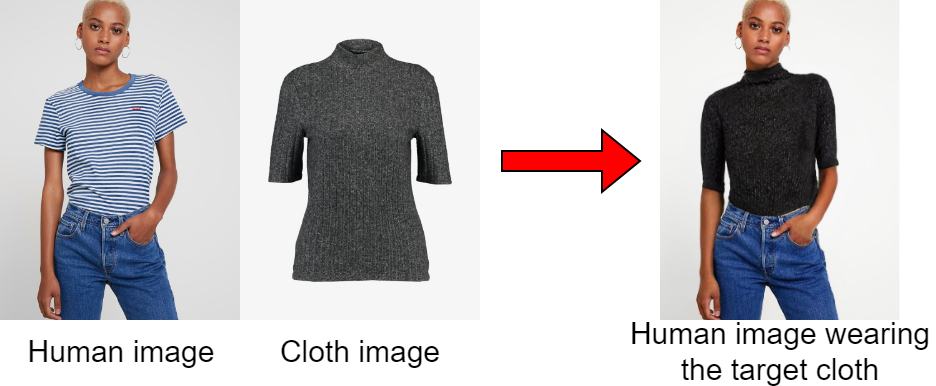
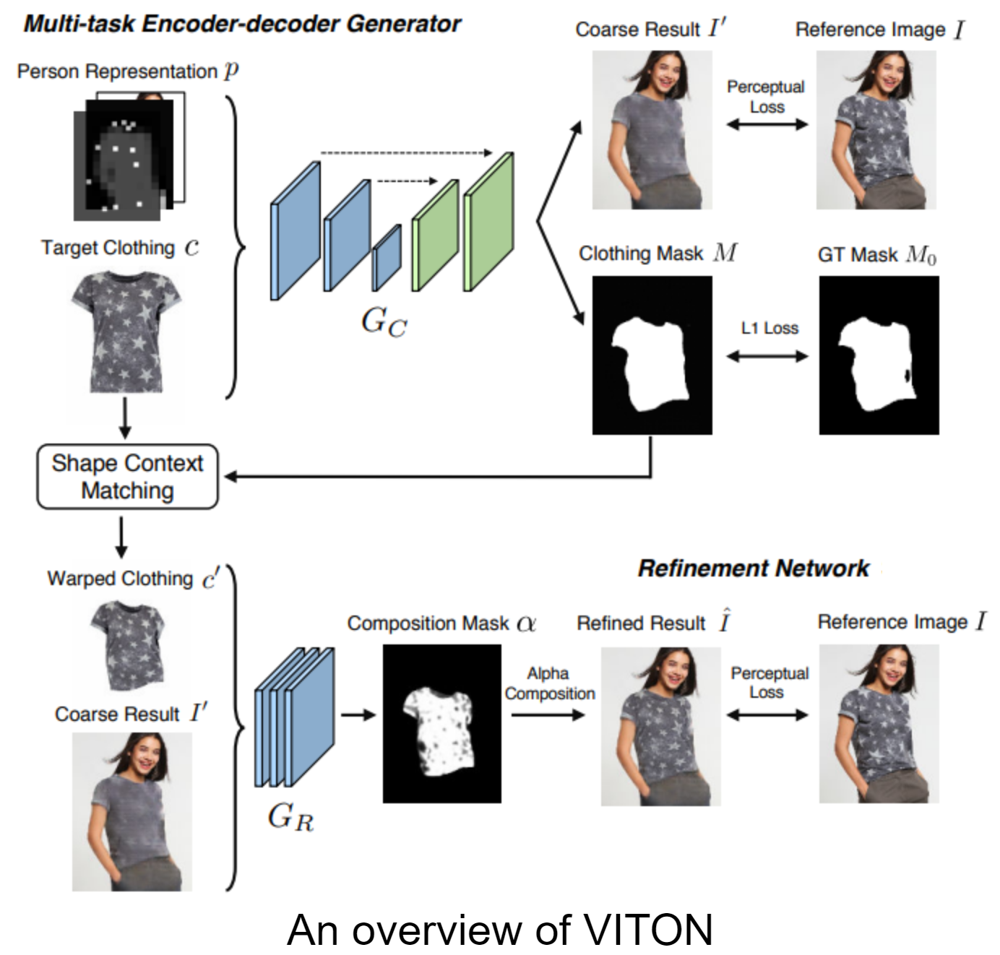
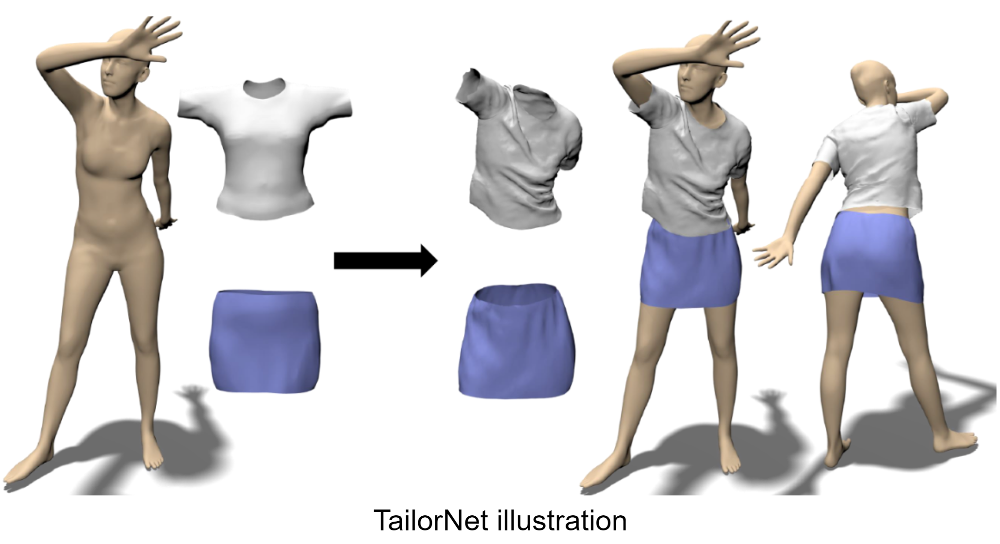
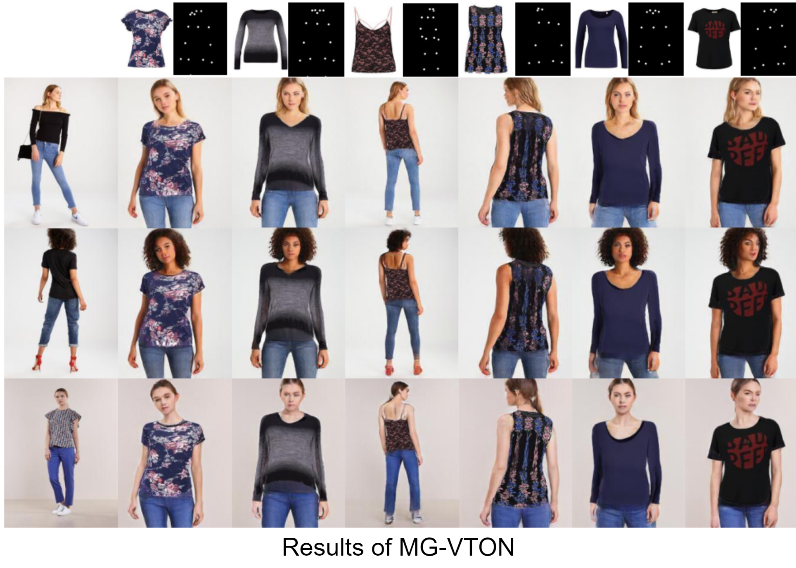
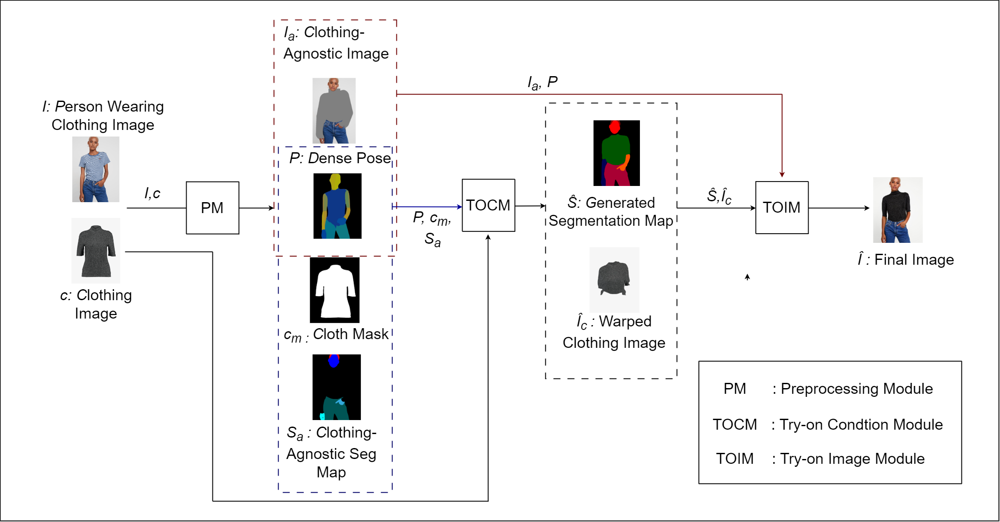
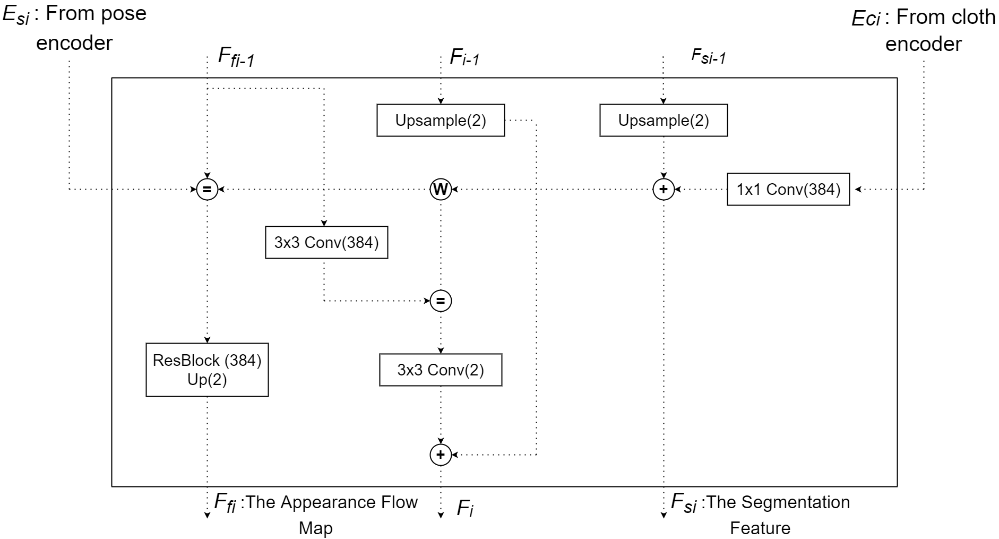
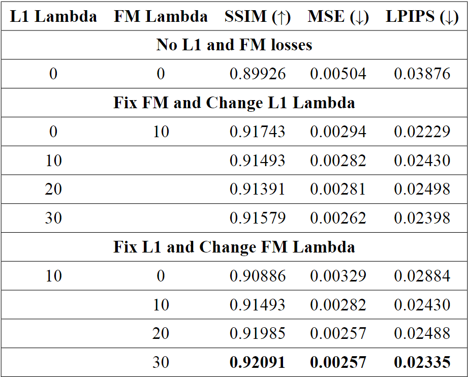
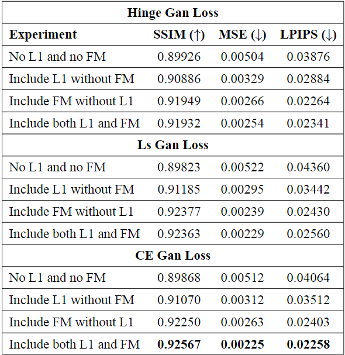
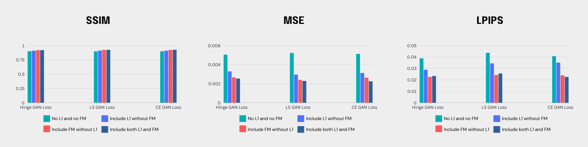

# THESIS

### DEVELOPING A VIRTUAL TRY-ON CLOTHES APPLICATION

NGUYỄN HOÀNG LINH 19125103 - NGUYỄN PHẠM TÙNG LÂM 19125056

#### THESIS ADVISORS

Mr. PHẠM MINH HOÀNG - Dr. VÕ HOÀI VIỆT

---
# Outline
- Introduction
- Related works 
- Implementation 
- Experiments
- Conclusion
- Demo: Web application

---

  
### Introduction

---
# Motivation

|                 |                     |
|-----------------|---------------------|
| **Traditional Shopping** | **Online Shopping**     |
| Require visit stores physically | Convenience         |
| Limited inventory | Wider range of products
| Able to try-on clothes | Unable to try on clothes |
| 
 | 
 |

---
# Virtual Try-On
- Task:
  - Digitally try on garments or accessories in a virtual environment
  - Allows users to see how clothing items would look on them

- Our target: 
  - Investigate and improve a related work
  - Develop a web application system employing the work

---

# Scope
- Image-based virtual try-on
- Human Image captured from a front view
- Clear background and minimal noise

---

  
### Related Works

---

# Several approaches to Virtual Try-on

- Image-based (2D) virtual try-on

- 3D virtual try-on

- Multi-pose guided virtual try-on

<!-- - Virtual try-on with diffusion models -->

---
### Image-based Virtual Try-on

- VITON (2018): An Image-based Virtual Try-on Network [1]

- VITON-HD (2021): High-Resolution Virtual Try-On via Misalignment-Aware Normalization [2]

- HR-VTON (2022): High-Resolution Virtual Try-On with Misalignment and Occlusion-Handled Conditions [3]

---
### 3D Virtual Try-on 

- DeepWrinkles (2018): Accurate and Realistic Clothing Modeling [4]
- TailorNet (2020): Predicting Clothing in 3D as a Function of Human Pose, Shape and Garment Style [5]
- M3D-VTON (2021): A Monocular-to-3D Virtual Try-On Network [6]

---
### Multi-Pose Guided Virtual Try-on

- MG-VTON (2019): Towards Multi-pose Guided Virtual Try-on Network [7]

- SPG-VTON (2021): Semantic Prediction Guidance for Multi-pose Virtual Try-on [8]

<!-- ---
# Virtual Try-on with Diffusion Models

- Uses diffusion models like DDPM instead of GANs

- Provides more control over quality and diversity

- More stable training process

- Notable works: TryOnDiffusion, LaDI-VTON -->

  
### Implementation

---

  
### System Overview

---

# Preprocessing Module

---

  <b>Clothing-agnostic Processing Flow </b>

---

### Try-On Condition Module

---

## Generator architecture

<!-- 

<b>Generator Architecture</b>

- Two encoders  
- Four feature fusion blocks
- Condition Aligning stage --> -->

<!-- 
 -->

---

### Feature Fusion Blocks

<!-- - Has two routes: the flow pathway and the seg pathway.
- Takes two inputs, $F_{f_{i-1}}$ and $F_{s_{i-1}}$.
- The two pathways communicate with each other to determine $F_{f_i}$ and $F_{s_i}$ simultaneously. -->

---

### Condition Aligning

- Aligns segmentation map $\hat{S}$ with clothing item $c$: 

$$\hat{S}_{logit} = \begin{cases} 
\hat{S}_{raw}^{k,i,j} & \text{if } k \neq C \\
\hat{S}_{raw}^{k,i,j} \cdot W(c_m,F_f) & \text{if } k = C  
\end{cases}$$

$$\hat{S}= \sigma (\hat{S}_{logit})$$ 

- Remove occlusion and get final $\hat{S}_c$ and $\hat{I}_c$.
---

  
### Multiscale Discriminator

  
### N-Layer Subdiscriminator

---
### Training Try-On Condition module
- Cross-entropy loss

$\mathcal{L}_{CE} = L(S, \hat{S}) = - [S \log p(S|\hat{S})+(1-S)\log(1-p(S|\hat{S}))] \tag{4.4}$

- L1 loss

$\mathcal{L}_{L1} =  \sum_{i=0}^3 w_i  .\left| \left|W(c_m,F_{f_i})-S_c \right| \right|_1 +||\hat{S_c}- S_c||_1 \tag{4.5}$

- VGG loss

$\mathcal{L}_{VGG} = \sum_{i=0}^3 w_i  . \phi(W(c,F_{f_i}),I_c) + \phi(\hat{I_c},I_c) \tag{4.6}$

---

### Training Try-On Condition module
- Loss TV

$\mathcal{L}_{TV}= ||\nabla F_{f4}|| \tag{4.7}$

- Least square GAN loss

$\mathcal{L}_{cGAN}=\underset{G}{min}V_{LS}(G)= \frac{1}{2}E_{z\sim p_{z}(z)} \left[\left(D\left(G(z)\right)-1\right)^2\right] \tag{4.9}$

---

# Training Try-On Condition module

Generator loss:

$$\mathcal{L}_{TOCG} = \lambda_{CE} \mathcal{L}_{CE} + \mathcal{L}_{cGAN} + \lambda_{L1}\mathcal{L}_{L1} + \mathcal{L}_{VGG} + \lambda_{TV}\mathcal{L}_{TV}$$

Discriminator loss:

$$\mathcal{L}_{D}^{LS} = \frac{1}{2}\mathbb{E}_{S\sim p_{data}(S)}[(D(S)-1)^2] + \frac{1}{2}\mathbb{E}_{z\sim p_z(z)}[D(G(z))^2]$$

---

### Try-On Image Module

---

### Try-on Image Generator architecture

---
### SPADE Residual Block

---
### Training Try-On Image
L1 loss

$\mathcal{L}_{L1} =  ||\hat{I}- I||_1 \tag{4.12}$

Feature Matching loss

$\mathcal{L}_{FM}=\frac{1}{k}\sum_{i=0}^{k-1}||Di(G(z)) - Di(I_i)||_1 \tag{4.13} \label{eq:FM}$

---
### Training Try-On Image
Apply different loss to $\mathcal{L}_{TOIG}^{cGAN}$ in each experiment
- Hinge Loss
- Least square loss
- Cross Entropy

---

### Training Try-On Image

Generator loss: 

$$\mathcal{L}_{TOIG} = \mathcal{L}_{TOIG}^{cGAN} + \lambda_{TOIG}^{VGG}\mathcal{L}_{TOIG}^{VGG} + \lambda_{TOIG}^{FM}\mathcal{L}_{TOIG}^{FM} + \lambda_{TOIG}^{L1}\mathcal{L}_{TOIG}^{L1}$$

Discriminator loss:

$\mathcal{L}_{D} = -\mathbb{E}_{I\sim p_{data}}[\text{max}(0, -1 + D(I))] - \mathbb{E}_{z\sim p_z}[\text{max}(0, -1 - D(\hat{I}))]$$

---

  
### Experiments

---

# Dataset

- High-resolution virtual try-on dataset from VITON-HD [2]
- 13,679 frontal-view woman and top clothing image pairs
- 1024 x 768 resolution
- 11,647 pairs for training, 2,032 for testing

---
 # Evaluation Metrics
 - SSIM
 $SSIM(x, y) = \frac{(2\mu_x\mu_y + C_1)(2\sigma_{xy} + C_2)}{(\mu_x^2 + \mu_y^2 + C_1)(\sigma_x^2 + \sigma_y^2 + C_2)}$

 - MSE
 $MSE(x, y) = \frac{1}{n}\sum_{i=1}^{n}(x_i - y_i)^2$

 - LPIPS
 $LPIPS(x, y) = \frac{1}{N}\sum_{i=1}^{N}|f_i(x) - f_i(y)|_2$

---
# Experiments

- Goal: Investigate and improve generator model performance by exploring different loss functions
- Focus: Loss function of Try-On Image module includes **GAN loss**, **L1 loss**, and **Feature Matching (FM) loss**.
- GAN loss function:
  - Cross-Entropy (CE) GAN loss
  - Least Square (LS) GAN loss
  - Hinge GAN loss

---

# Experiments
Two experiments conducted:
- Experiment 1:
Investigate impact of L1 and FM losses on generator performance and find optimal set of lambda values for generator loss function

- Experiment 2:
Analyze specific impact of each GAN loss function in combination with L1 and FM on performance of generator model

---

## Experiment 1: L1 vs. FM Loss

<!-- 

 -->
Test cases:
- No L1 and no FM losses
- Fix the FM lambda at 10 and vary L1 lambda between 10 and 40
- Fix the L1 lambda at 10 and vary FM lambda between 10 and 40

Models trained using original paper parameters:
- $512\times384$ resolution
- 8 batch size
- Training steps: 30,000

---

## Experiment 1: L1 vs. FM Loss

---
## Experiment 1: L1 vs. FM Loss

- L1 and FM losses improve generator performance
- FM more impactful than L1

---

## Experiment 2: GAN Losses

- Use parameters and optimal lambda values found Experiment 1
- Try different GAN loss functions: **CE GAN loss**, **LS GAN loss** and **Hinge GAN loss**
- As for each GAN loss function:
  - No L1 and no FM
  - Include L1 without FM
  - Include FM without L1
  - Include both L1 and FM
---

## Experiment 2: GAN Losses

---

## Experiment 2: GAN Losses

- GAN loss combined with L1 and FM acan significantly impact the performance of a generator
- Cross-Entropy (CE) GAN loss function is the most effective

--- 

## Application

---

## Application

---

## Application Overview

- Architecture: Microservice 

- Programming language: Python

- Communication between services: gRPC

- User interface: Streamlit

- Deploy: Docker

---

## Application Pipeline

---

<!-- ## Discussion

--- -->

<!-- ## Limitations

- HR-VITON model requires resource intensive for training.
- Complex pre-processing.
- Application works but slow runtime, particularly segmentation map of the human.
- Pre-processing must match dataset
  
--- -->

  
### Conclusion

---

# Conclusion

- Achieved promising results for virtual try-on application
- Provided insights into effectiveness of loss functions when training HR-VITON model
- Web application makes research accessible
- Future research: Optimizing the pre-processing steps and exploring alternative models

---
# References

[1]: X. Han, Z. Wu, Z. Wu, R. Yu, and L. S. Davis, “Viton: An image-based virtual try-on network,” in Proceedings of the IEEE conference on computer vision and pattern recognition, 2018, pp. 7543–7552.

[2]: S. Choi, S. Park, M. Lee, and J. Choo, “Viton-hd: High-resolution virtual try-
on via misalignment-aware normalization,” in Proc. of the IEEE conference on
computer vision and pattern recognition (CVPR), 2021.

[3]: S. Lee, G. Gu, S. Park, S. Choi, and J. Choo, “High-resolution virtual try-on with misalignment and occlusion-handled conditions,” 2022.

--- 

# References

[4]: Z. Lahner, D. Cremers, and T. Tung, “Deepwrinkles: Accurate and realistic clothing modeling,” in Proceedings of the European conference on computer
vision (ECCV), 2018, pp. 667–684.

[5]: C. Patel, Z. Liao, and G. Pons-Moll, “Tailornet: Predicting clothing in 3d as a function of human pose, shape and garment style,” in Proceedings of the IEEE/CVF conference on computer vision and pattern recognition, 2020, pp. 7365–7375.

[6]: F. Zhao, Z. Xie, M. Kampffmeyer, H. Dong, S. Han, T. Zheng, T. Zhang, and X. Liang, “M3d-vton: A monocular-to-3d virtual try-on network,” in Proceedings of the IEEE/CVF International Conference on Computer Vision, 2021, pp. 13 239–13 249.

---

# References

[7]: H. Dong, X. Liang, X. Shen, B. Wang, H. Lai, J. Zhu, Z. Hu, and J. Yin, “Towards multi-pose guided virtual try-on network,” in Proceedings of the IEEE/CVF international conference on computer vision, 2019, pp. 9026–9035.

[8]: B. Hu, P. Liu, Z. Zheng, and M. Ren, “Spg-vton: Semantic prediction guidance for multi-pose virtual try-on,” IEEE Transactions on Multimedia, vol. 24, pp. 1233–1246, 2022.
